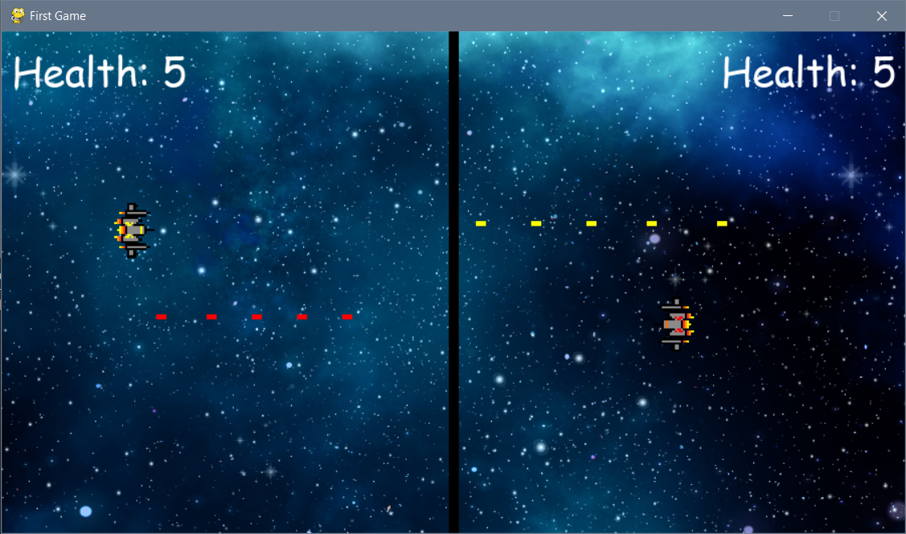

# Two-Player Space Shooter Game

## Description
A thrilling two-player space shooter game implemented in Python using the Pygame library and Object-Oriented Programming (OOP) principles. In this game, two players control their spaceships, shooting each other down until one player reaches zero lives.

## Features
 - Player Controls:
   - Player 1: Moves using W, A, S, D keys and shoots with the X key.
   - Player 2: Moves using the arrow keys and shoots with the L key.
 - Lives System:
   - Each player starts with a set number of lives.
   - The game continues until one player loses all their lives.
 - Score Display:
   - Real-time display of each player's remaining lives.
##

